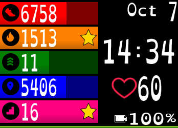

# Description
A really simple and fun. You can select many options from settings.
It use a font designed to make life easier for dyslexic people.
This clock is build for fitbit smartwatchs (Ionic, Versa, Versa 2 and Versa Light).

# Features
It include :
- Clock.
- Date.
- Stats.
- Battery indicator (with ability to show or hide).
- Heart Rate Monitor.
- Settings to change colors and H24 format.

Let me know if you need more ;)

# Demo
This clock can be installed on your Ionic or Versa via this link: [Fitbit store](https://gallery.fitbit.com/details/b83ed1f9-3562-4f76-8397-4bae9cf9d22d)

# Why?
I have shared this code to allow developer to make more clocks accessible for dyslexic users.

Please do use this clock as this, change it to have your hown design

# How to edit and buid?
This code was build for and with Visual Studio Code.

It use :
- NPM
- Fitbit SDK
- TypeScript
- SVG
- CSS

# Need something?
Ask me if you need any help or new features.